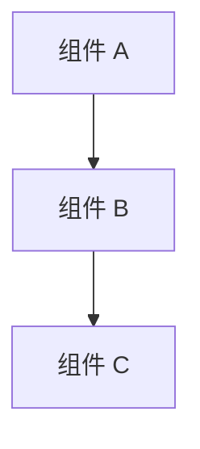

# 设计文档

## 概述

[对本功能的高层级描述，及其在整个系统中的定位与作用]

## 与指导文档对齐情况

### 技术标准（tech.md）
[说明本设计如何遵循已记录的技术模式与标准，如框架选型、API规范、状态管理方案等]

### 项目结构（structure.md）
[说明本功能实现将如何遵循项目既定的组织约定，如文件目录结构、命名规范、模块划分等]

## 代码复用分析
[说明本功能将复用、扩展或集成哪些现有代码]

### 可复用的现有组件
- **[组件/工具名称]**：[将如何使用该组件]
- **[服务/辅助函数名称]**：[将如何扩展或适配该服务]

### 集成点
- **[现有系统/API 名称]**：[新功能将如何与其集成，如调用方式、数据格式、认证机制等]
- **[数据库/存储系统]**：[数据如何与现有数据表或模式对接，是否需新增字段或关联表]

## 架构设计

[描述整体架构及所采用的设计模式，如 MVC、分层架构、事件驱动等]



## 组件与接口

### 组件 1
- **用途**：[该组件的功能与职责]
- **接口**：[公开方法/API 列表及参数说明]
- **依赖项**：[该组件所依赖的其他模块或服务]
- **复用内容**：[基于哪些现有组件或工具构建]

### 组件 2
- **用途**：[该组件的功能与职责]
- **接口**：[公开方法/API 列表及参数说明]
- **依赖项**：[该组件所依赖的其他模块或服务]
- **复用内容**：[基于哪些现有组件或工具构建]

## 数据模型

### 模型 1
```
[以项目所用语言定义 Model1 的结构]
- id: [唯一标识符类型，如 UUID / Integer]
- name: [字符串/文本类型]
- [其他所需属性，如 status, createdAt, updatedAt 等]
```

### 模型 2
```
[以项目所用语言定义 Model2 的结构]
- id: [唯一标识符类型]
- [其他所需属性]
```

## 错误处理

### 错误场景
1. **场景 1**：[错误描述，如“用户输入无效”]
    - **处理方式**：[如何捕获与处理，如返回 400 错误 + 友好提示]
    - **用户影响**：[用户将看到什么，如表单错误提示]

2. **场景 2**：[错误描述，如“第三方服务不可用”]
    - **处理方式**：[如何处理，如降级策略、重试机制、记录日志]
    - **用户影响**：[用户将看到什么，如“服务暂时不可用，请稍后重试”]

## 测试策略

### 单元测试
- [单元测试方法，如测试每个函数/类的独立行为]
- [需重点测试的关键组件，如核心计算逻辑、验证函数等]

### 集成测试
- [集成测试方法，如测试模块间交互、API 调用、数据库操作等]
- [需测试的关键流程，如用户注册 → 发送邮件 → 数据库写入]

### 端到端测试
- [端到端测试方法，如模拟真实用户操作流程]
- [需测试的用户场景，如“用户登录 → 创建订单 → 支付成功”]
